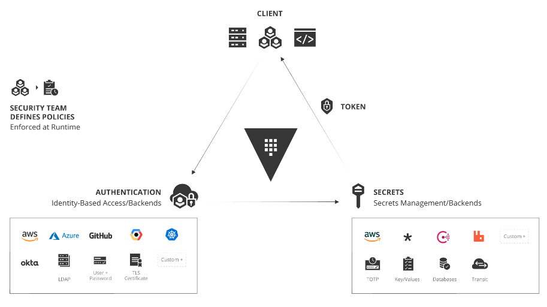

# Vautl-Secrets-Management



### **Types of Vault Runs:**

1. **Dev Mode:** 🛠️  
   - For testing, run Vault in dev mode using the binary file.

2. **VM Mode:** 🖥️  
   - Run Vault as a VM, ideal for a 3-node or 5-node cluster with one leader and two followers.

3. **Kubernetes Pod:** 🚀  
   - Deploy Vault as a Kubernetes pod. Since Kubernetes secrets are only base64 encoded, Vault ensures secure secret management.

### **Use Cases:**

- Vault is versatile 🔒, used for secure storage like bank credit storage, reward points, and encryption of sensitive data.

### **Enterprise Deployment:**

- In enterprises 🌐, Vault is deployed for disaster recovery and performance across regions and clouds.
- From a Kubernetes perspective, Vault is seen as an application and requires server mesh support, running on every node.

### **Secret Engines:**

- Vault has various secret engines ⚙️ for tasks like storing, generating, and encrypting data.
- Common engines include `kv`, PKI Certificate, SSH, Transit, TOTP, LDAP, and Kubernetes.
- These engines are categorized under Cloud ☁️ (e.g., AWS, Azure, Google Cloud) and Infrastructure 🏗️ (e.g., Consul, Database, RabbitMQ).

## Installing Vault

- https://developer.hashicorp.com/vault/install
- For Ubuntu

```
wget -O- https://apt.releases.hashicorp.com/gpg | sudo gpg --dearmor -o /usr/share/keyrings/hashicorp-archive-keyring.gpg

echo "deb [signed-by=/usr/share/keyrings/hashicorp-archive-keyring.gpg] https://apt.releases.hashicorp.com $(lsb_release -cs) main" | sudo tee /etc/apt/sources.list.d/hashicorp.list

sudo apt update && sudo apt install vault
```

## Starting the Vault Dev Server
```
vault server -dev
```

output
```
vagrant@cloud-native-box:~/hand-on-vault/vault-secret-management$ vault server -dev
==> Vault server configuration:

Administrative Namespace: 
             Api Address: http://127.0.0.1:8200
                     Cgo: disabled
         Cluster Address: https://127.0.0.1:8201
   Environment Variables: DBUS_SESSION_BUS_ADDRESS, GOTRACEBACK, HOME, LANG, LC_CTYPE, LOGNAME, MOTD_SHOWN, OLDPWD, PATH, PWD, SHELL, SHLVL, SSH_AUTH_SOCK, SSH_CLIENT, SSH_CONNECTION, SSH_TTY, TERM, USER, XDG_DATA_DIRS, XDG_RUNTIME_DIR, XDG_SESSION_CLASS, XDG_SESSION_ID, XDG_SESSION_TYPE, _
              Go Version: go1.22.5
              Listener 1: tcp (addr: "127.0.0.1:8200", cluster address: "127.0.0.1:8201", disable_request_limiter: "false", max_request_duration: "1m30s", max_request_size: "33554432", tls: "disabled")
               Log Level: 
                   Mlock: supported: true, enabled: false
           Recovery Mode: false
                 Storage: inmem
                 Version: Vault v1.17.3, built 2024-08-06T14:28:45Z
             Version Sha: c91c85442144e1228c02123fc4b19337f7d52700

==> Vault server started! Log data will stream in below:

2024-08-22T19:22:54.712Z [INFO]  proxy environment: http_proxy="" https_proxy="" no_proxy=""
2024-08-22T19:22:54.712Z [INFO]  incrementing seal generation: generation=1
2024-08-22T19:22:54.712Z [WARN]  no `api_addr` value specified in config or in VAULT_API_ADDR; falling back to detection if possible, but this value should be manually set
2024-08-22T19:22:54.712Z [INFO]  core: Initializing version history cache for core
2024-08-22T19:22:54.712Z [INFO]  events: Starting event system
2024-08-22T19:22:54.714Z [INFO]  core: security barrier not initialized
2024-08-22T19:22:54.714Z [INFO]  core: security barrier initialized: stored=1 shares=1 threshold=1
2024-08-22T19:22:54.714Z [INFO]  core: post-unseal setup starting
2024-08-22T19:22:54.721Z [INFO]  core: loaded wrapping token key
2024-08-22T19:22:54.721Z [INFO]  core: successfully setup plugin runtime catalog
2024-08-22T19:22:54.721Z [INFO]  core: successfully setup plugin catalog: plugin-directory=""
2024-08-22T19:22:54.722Z [INFO]  core: no mounts; adding default mount table
2024-08-22T19:22:54.723Z [INFO]  core: successfully mounted: type=cubbyhole version="v1.17.3+builtin.vault" path=cubbyhole/ namespace="ID: root. Path: "
2024-08-22T19:22:54.724Z [INFO]  core: successfully mounted: type=system version="v1.17.3+builtin.vault" path=sys/ namespace="ID: root. Path: "
2024-08-22T19:22:54.724Z [INFO]  core: successfully mounted: type=identity version="v1.17.3+builtin.vault" path=identity/ namespace="ID: root. Path: "
2024-08-22T19:22:54.725Z [INFO]  core: successfully mounted: type=token version="v1.17.3+builtin.vault" path=token/ namespace="ID: root. Path: "
2024-08-22T19:22:54.725Z [INFO]  rollback: Starting the rollback manager with 256 workers
2024-08-22T19:22:54.726Z [INFO]  core: restoring leases
2024-08-22T19:22:54.726Z [INFO]  rollback: starting rollback manager
2024-08-22T19:22:54.727Z [INFO]  expiration: lease restore complete
2024-08-22T19:22:54.727Z [INFO]  identity: entities restored
2024-08-22T19:22:54.727Z [INFO]  identity: groups restored
2024-08-22T19:22:54.728Z [INFO]  core: Recorded vault version: vault version=1.17.3 upgrade time="2024-08-22 19:22:54.72790631 +0000 UTC" build date=2024-08-06T14:28:45Z
2024-08-22T19:22:54.728Z [INFO]  core: post-unseal setup complete
2024-08-22T19:22:54.729Z [INFO]  core: root token generated
2024-08-22T19:22:54.729Z [INFO]  core: pre-seal teardown starting
2024-08-22T19:22:54.729Z [INFO]  rollback: stopping rollback manager
2024-08-22T19:22:54.729Z [INFO]  core: pre-seal teardown complete
2024-08-22T19:22:54.729Z [INFO]  core.cluster-listener.tcp: starting listener: listener_address=127.0.0.1:8201
2024-08-22T19:22:54.729Z [INFO]  core.cluster-listener: serving cluster requests: cluster_listen_address=127.0.0.1:8201
2024-08-22T19:22:54.729Z [INFO]  core: post-unseal setup starting
2024-08-22T19:22:54.729Z [INFO]  core: loaded wrapping token key
2024-08-22T19:22:54.729Z [INFO]  core: successfully setup plugin runtime catalog
2024-08-22T19:22:54.729Z [INFO]  core: successfully setup plugin catalog: plugin-directory=""
2024-08-22T19:22:54.730Z [INFO]  core: successfully mounted: type=system version="v1.17.3+builtin.vault" path=sys/ namespace="ID: root. Path: "
2024-08-22T19:22:54.730Z [INFO]  core: successfully mounted: type=identity version="v1.17.3+builtin.vault" path=identity/ namespace="ID: root. Path: "
2024-08-22T19:22:54.730Z [INFO]  core: successfully mounted: type=cubbyhole version="v1.17.3+builtin.vault" path=cubbyhole/ namespace="ID: root. Path: "
2024-08-22T19:22:54.731Z [INFO]  core: successfully mounted: type=token version="v1.17.3+builtin.vault" path=token/ namespace="ID: root. Path: "
2024-08-22T19:22:54.731Z [INFO]  rollback: Starting the rollback manager with 256 workers
2024-08-22T19:22:54.731Z [INFO]  core: restoring leases
2024-08-22T19:22:54.731Z [INFO]  expiration: lease restore complete
2024-08-22T19:22:54.731Z [INFO]  rollback: starting rollback manager
2024-08-22T19:22:54.731Z [INFO]  identity: entities restored
2024-08-22T19:22:54.731Z [INFO]  identity: groups restored
2024-08-22T19:22:54.731Z [INFO]  core: post-unseal setup complete
2024-08-22T19:22:54.731Z [INFO]  core: vault is unsealed
2024-08-22T19:22:54.737Z [INFO]  core: successful mount: namespace="" path=secret/ type=kv version="v0.19.0+builtin"
WARNING! dev mode is enabled! In this mode, Vault runs entirely in-memory
and starts unsealed with a single unseal key. The root token is already
authenticated to the CLI, so you can immediately begin using Vault.

You may need to set the following environment variables:

    $ export VAULT_ADDR='http://127.0.0.1:8200'

The unseal key and root token are displayed below in case you want to
seal/unseal the Vault or re-authenticate.

Unseal Key: wxxxxxxxxxxxxxxxzxxxx
Root Token: hvs.xxxxxxxxxx

Development mode should NOT be used in production installations!

```

```
- runs entirely in-memory
- starts unsealed with a single unseal key
- The root token is already authenticated to the CLI
```


If your vault is running on vagrant,

``` 
vault server -dev -dev-listen-address="0.0.0.0:8200"

```


Set environment variable

```
export VAULT_ADDR='http://127.0.0.1:8200'
```

## vault status 


## Verify via Vault HTTP API /sys/seal-status endpoint

```
curl http://127.0.0.1:8200/v1/sys/seal-status | jq
```


- Verify vault auth list

```
vagrant@cloud-native-box:~$ vault auth list
Path      Type     Accessor               Description                Version
----      ----     --------               -----------                -------
token/    token    auth_token_fff07cc9    token based credentials    n/a
vagrant@cloud-native-box:~$ 
```

```
curl --header "X-Vault-Token:  hvs.xxxxxxxxxxxxxxxxxxxx" http://127.0.0.1:8200/v1/sys/auth | jq
```


- Enable kv v1 Secrets Engine
- Enable `kv` secrets engine. If we don’t define path, it will set `kv` itself.

```
vault secrets enable kv
```
```
vagrant@cloud-native-box:~$ vault secrets enable kv
Success! Enabled the kv secrets engine at: kv/
```


vault secrets enable kv is equivalent to vault secrets -version=1 -path=kv kv 


Enable kv secrets engine and define --path=payment-team, --path=reward-points-team , --path=database-team


```
vagrant@cloud-native-box:~$ vault secrets enable --path=payment-team kv
Success! Enabled the kv secrets engine at: payment-team/
vagrant@cloud-native-box:~$ vault secrets enable --path=rewardpoints-team kv
Success! Enabled the kv secrets engine at: rewardpoints-team/
vagrant@cloud-native-box:~$ vault secrets enable --path=database-team kv
Success! Enabled the kv secrets engine at: database-team/
vagrant@cloud-native-box:~$ 
```


```
vagrant@cloud-native-box:~$ vault secrets list
Path                  Type         Accessor              Description
----                  ----         --------              -----------
cubbyhole/            cubbyhole    cubbyhole_929c7693    per-token private secret storage
database-team/        kv           kv_8965d9d0           n/a
identity/             identity     identity_a910bf17     identity store
kv/                   kv           kv_4bd556c6           n/a
payment-team/         kv           kv_ef1de43f           n/a
rewardpoints-team/    kv           kv_bec6d677           n/a
secret/               kv           kv_563aeb0e           key/value secret storage
sys/                  system       system_aa247248       system endpoints used for control, policy and debugging
vagrant@cloud-native-box:~$ 
```
**Happy Vault...!!!**
